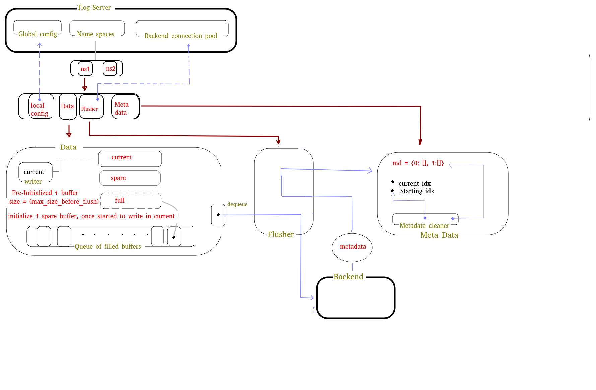

## Specs



## Main components

**Tlog server**

- `global config object` :: contains global configuration for TLOG server
- `Namespaces` :: a dictionary mapping a name to a namespace object
- `Backend connection pool` :: get a connection to backend to flush data

**namespace**
- `configuration object` has access to global TLOG server configuration
- `Data buffer` object :: Time stamping incoming data and buffeing them for flush in a local queue
- `Metadata buffer` :: Metadata store, allowing fast replay between 2 time spans
- `Metadata cleaner` :: Async routine cleaning meta data older than specific age and may flush them into d
- `flusher` :: Async routine to flushes data to backend and saves metadata into `Metadata buffer`


**Data buffer**

We don't want to block writing to a namespace buffer, so we follow the following design

- when a name space is created, we  allocate an array of size = `max_size_before_flush`, we call it `current_buffer`
- once write operations start on `current_buffer` we allocate another buffer called `spare_buffer` of size =  `max_size_before_flush`
- once `current_buffer` is full, we make `current_buffer` = `spare_buffer`
- we append a reference to old buffer to a local queue (per namespace)
- once write operations starts on `current_buffer` we make sure again we create a new `spare_buffer` of size =`max_size_before_flush` and so on
- local queue will be dequeued later by an async routine (one per namespace)
- buffered data format :: `[Header: timestamp][Actual data]`

**Flusher**
- we have an async routing per name space to dequeue data, flush into backend then save metadata into `Metadata buffer`

**Metadata Store**

- we want to save metadata into a data structure that allows for fast replay between a time span
and in same time allowing us to go back and forth between data
- we don't want to use a lnked list because it is slow (slower than iterating over array of fixed size)
- we use the following algorithm
    ```
    current_index = -1
    starting_index = 0
    md = {}
    ```

    - we use a dictionary to hold metadata
    - keys of dictionary are integers (sequential)
    - when adding a new key, we increment `current_index` variable and use it as a key
    - values look like : `[Header: timestamp][Actual data]`
    - when cleaning metadata older than certain age, we set `starting_index` to the new starting index in dictionary
now any furhter future cleaning operations can know which index to start at. also any searching operation can know which index
to start at
    - For searching for starting time span we try random dictionary index > `starting_index` and < `current_index` and see if value has epoch thT matche the beginning of time span we want
and if not, we can use binary search through the indeCES to get the right data


